# Code over Configuration 〜 Compute@Edge は VCL に置き換わるのか

2022-03-29 Fastly User Meetup #4

Yusuke Wada

---

## トラベルブック

1. 「旅行商品比較サイト」
2. 「旅行・ライフスタイルメディア」


テックブログやってます。

TravelBook Tech Blog<br>
<https://tech.travelbook.co.jp/>

---

## アジェンダ

「Compute@EdgeはVCLに置き換わるのか？」

1. 機能
2. 開発
3. 性能

---

今回、Compute@EdgeはJavaScriptによる実装を前提としています

---

# イントロ

---

## CDNのエッジで実行する系いろいろ

* Cloudflare Workers
* Fastly Compute@Edge
* AWS CloudFront Functions
* AWS Lambda@Edge
* Deno Deploy
* Vercel Edge Functions
* Netlify Functions

CDNのエッジで実行する系が面白い - ゆーすけべー日記
<https://yusukebe.com/posts/2021/functions-at-edge/>

---

## 中でもCloudflare WorkersとCompute@Edgeの比較

JavaScriptにおいては、どちらもService Worker互換

使ってみて

---

### Cloudflare Workers

* アプリケーション寄り
* KV、Durable Objectsなど
* 例: Remixが動く

Supporting Remix with full stack Cloudflare Pages
https://blog.cloudflare.com/remix-on-cloudflare-pages/

---

### Fastly Compute@Edge

* FastlyはCDNが強い
* Compute@Edgeはバックエンドがないと警告が出る
  * ＊そのうち変わるかもしれない

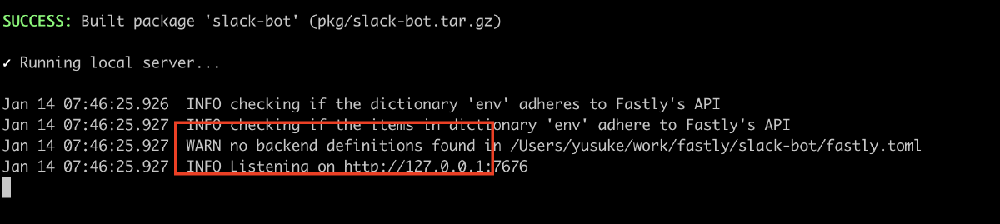

---

DOOMのようなアプリケーション寄りのデモもあるが...

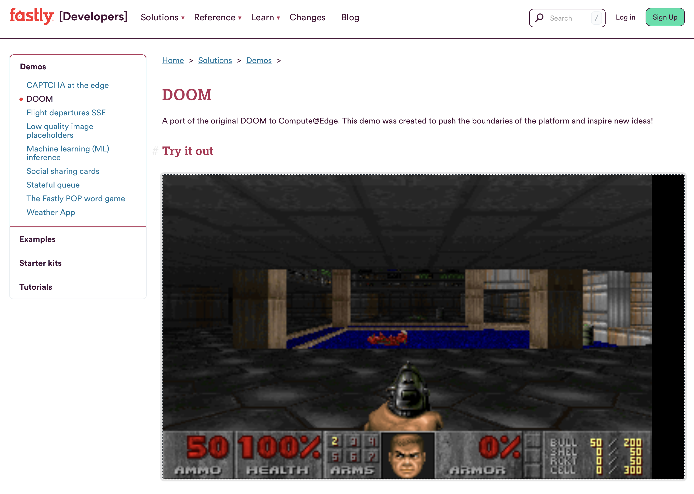

DOOM | Fastly Developer Hub
https://developer.fastly.com/solutions/demos/doom/

---

Fastly Compute@Edgeは「**CDNに強い**」

---

## 余談

Fastly vs Cloudflare

* **Cloudflare**: ネットワークパフォーマンスの最新情報：Full Stack Week <https://blog.cloudflare.com/ja-jp/network-performance-update-full-stack-week-ja-jp/>
* **Fastly**: 嘘、大嘘、そして (Cloudflareの) 統計 : Cloudflareのパフォーマンステストの欠陥を証明 | Fastly <https://www.fastly.com/jp/blog/debunking-cloudflares-recent-performance-tests>

---

CDNに強い？

=> バックエンドを活かす

---

### ただし、FastlyにはVCLがある

*Varnish Configuration Language* 

あくまで**Varnish**（キャッシュサーバ）の**設定言語**

---

VCLでできることはCompute@Edgeでできるのではないか？

---

> Code over Configuration

---

「Edge Functions – Vercel」のページより

https://vercel.com/features/edge-functions

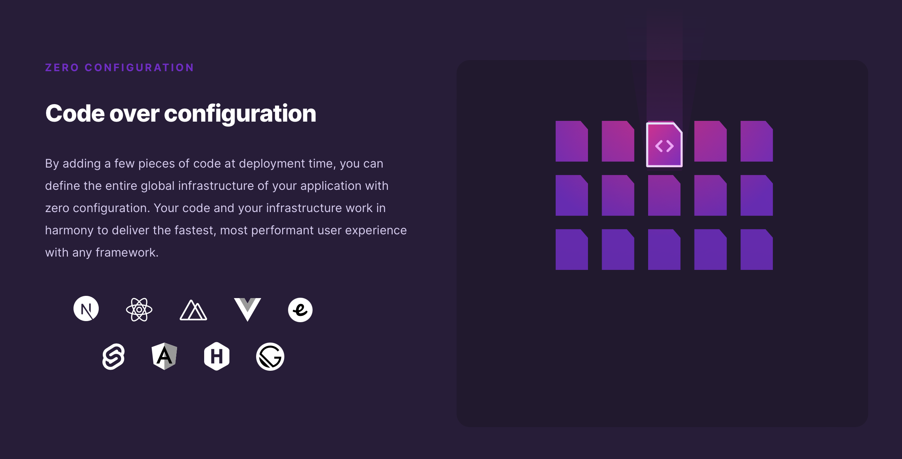

---

## Compute@EdgeはVCLに置き換わるのか

---

# 1. 機能

---

### 「Migrate from VCL」というドキュメントがある

Migrate from VCL | Fastly Developer Hub
https://developer.fastly.com/learning/compute/migrate/

---

### 「How we migrated developer.fastly.com from VCL to Compute@Edge」という記事もある

2022/03/16

How we migrated developer.fastly.com from VCL to Compute@Edge | Fastly<br >
https://www.fastly.com/blog/how-we-migrated-developer-fastly-com-from-vcl-to-compute-edge

---

Compute@Edgeでできること

---

Configuration

* Edge dictionaryから設定データを取得する

---

Request

* リクエストヘッダを追加する
* クエリストリングのソートとサニタイズ
* リクエストからクエリストリングを抜き出す
* リクエストから特定のヘッダを削除する
* リクエストパスを変更する
* 特定のヘッダが存在するか確認する
* ヘッダの値に指定した文字列が存在するか確認する
* リクエストボディを取得する
* クライアントのGeo情報を取得する

---

Backends

* リクエストのパスごとにバックエンドを切り替える
* エラーが起きたらもう一つのバックエンドを使う

---

Response

* スクラッチでレスポンスを作成する
* 画像を返す
* レスポンスヘッダを設定する

---

Controlling the cache

* 明示的にTTLを設定する
* 強制的にpassする
* SWRを指定する

---

## トラベルブックがVCLでやってることもほぼ全てカバー

---

トラベルブックがやってること1

* Edge Dictionary
* UAによるステータスコードの変更
* Basic認証
* 検証かどうか環境の判定
* リクエストメソッドによる分岐
* クッキーのありなしの判定
* デバイス判定
* パスによるバックエンドの変更

---

トラベルブックがやってること2

* キャッシュキーの作成（URL、デバイス、ホスト）
* ステータスコードでキャッシュの有無
* パスによってTTLを変更
* SWR、Stale-IF-Errorの設定
* レスポンスヘッダの設定（x-ttl）
* Varyヘッダの変更
* サロゲートキーの生成
* エラーの場合、S3のエラーページを表示
* 401のsyntheticレスポンスの変更
* noindexヘッダ
* ユニークIDの生成（sha256）

---

## 工夫が必要なもの

---

### HTTP/3 - alt svcヘッダの追加 `h3.alt_svc()`

自分でヘッダに足す

---

### Brotoli、Gzipの設定 `set beresp.gzip = true`

X-Compress-Hint | Fastly Developer Hub
https://developer.fastly.com/reference/http/http-headers/X-Compress-Hint/

---

## (たぶん)できないこと

---

* ACL `client.ip ~ ${ip_block_acl_name}`
* `Fastly-Debug:1`ヘッダが効かない => 自分でやれ？
* 実験的な機能、 `h2.early_hints`

---

## 注意したほうがいいこと

---

* 環境変数が使えない => Edge Dictionaryで変数を管理する

Fastly Compute@Edgeについて分かったこと – TravelBook Tech Blog<br> https://tech.travelbook.co.jp/posts/fastly-compute-at-edge/

---

ほぼ全ての機能をCompute@Edgeがカバー

---

### 逆にCompute@Edgeだからできる機能

例

* ダイナミックに`Link`ヘッダをつける
* Signed Exchange

sxg-rs/fastly_compute at main · google/sxg-rs
https://github.com/google/sxg-rs/tree/main/fastly_compute

---

### 要望

* パスごとにVCL、Computeと分けたい <= 今だとプロジェクト単位

---

# 2. 開発

---

> (あらためて)JavaScriptで書ける！！

---

## VCL

```perl
set obj.status = 200;
synthetic "Hello world";
return(deliver);
```

---

## Compute@Edge


```js
const handleRequest = async (request) => {
  return new Response("Compute@Edge!")
}
addEventListener("fetch", event => {
  event.respondWith(handleRequest(event.request))
})
```

---

## Codeである意味

1. 標準であること
2. 再利用性
3. 仮想環境
4. テスト

---

Codeである意味

## 1. 標準であること

---

## Service Worker (like) API

---

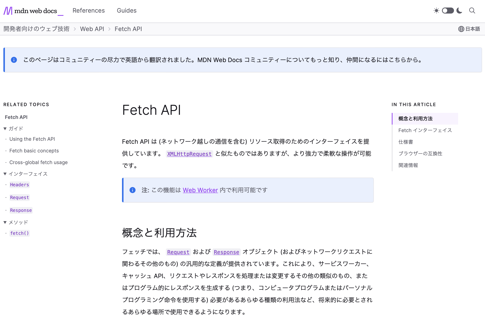

Fetch API - Web API | MDN
https://developer.mozilla.org/ja/docs/Web/API/Fetch_API

---

### 標準のAPIが使える

```js
const path = new URL(req.url).pathname // Request, URL
const ua = req.headers.get('User-Agent') // Headers
res.headers.append('X-Debug', `${path} - ${ua}`) // Response
```

---

### `@fastly/js-compute`

* Dictionary
* Env
* Headers
* Request
* Response
* TextDecoder
* TextEncoder
* URL
* URLSearchParams

@fastly/js-compute - v0.2.4 | @fastly/js-compute - v0.2.4
https://js-compute-reference-docs.edgecompute.app/

---

TypeScriptでも書ける

TS => JS => Wasm

---

## 型がある

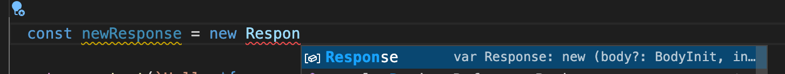
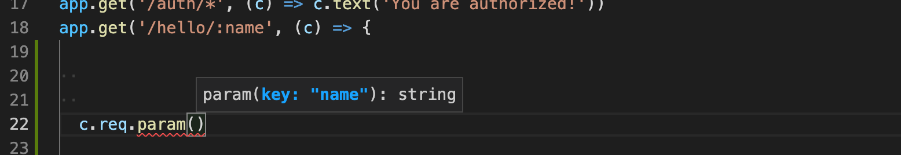

---

Codeである意味

## 2. 再利用性

---

* ありものを使える
* 作ったものをあとから使える

---

### ルーター・フレームワーク

* itty-router
* Sunder
* worktop
* Hono

Service Worker互換なので「Cloudflare Workers向け」を謳っているものも使える

---

## Hono\[炎\]


> Hono\[炎\] - Ultrafast web framework for Cloudflare Workers ( and Fastly Compute@Edge ).

yusukebe/hono: Hono[炎] - Ultrafast web framework for Cloudflare Workers.<br>
https://github.com/yusukebe/hono

---

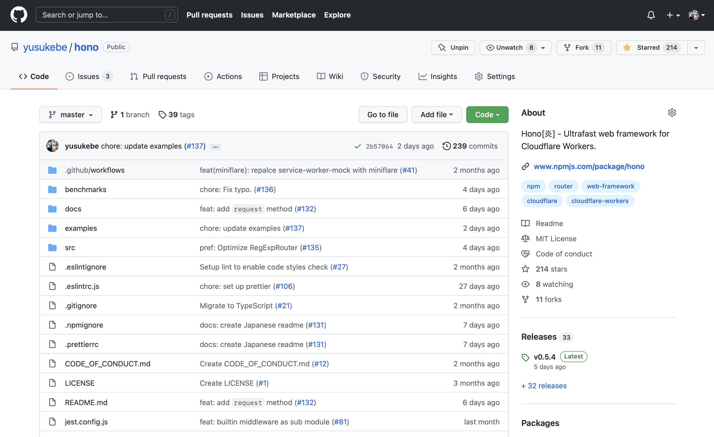

---

* ルーティング
* Request/Responseへのショートカット
* Middleware

---

### Basic

```js
import { Hono } from 'hono'

export const app = new Hono()
app.get('/', (c) => c.text('Compute@Edge!!!'))
```

---

### Custom Middleware

```js
app.use('*', async (c, next) => {
  const ua = c.req.header('User-Agent') || ''
  await next()
  if (ua.match(/MalBot/)) {
    c.res = c.text('Forbidden', 403)
  }
})
```

---

### Built-in Middleware

```js
app.use(
  '/auth/*',
  basicAuth({
    username: 'compute',
    password: 'edge',
    hashFunction: (m: string) => SHA256(m).toString(),
  })
)
app.get('/auth/*', (c) => c.text('You are authorized!'))
```

---

* basic-auth
* body-parse
* cookie
* cors
* etag
* graphql-server
* logger
* mustache
* powered-by
* serve-static*

---

### With Backend

```js
app.get('/backend', (c) => {
  const backendResponse = fetch(c.req as Request, {
    backend: 'origin_a',
  })
  return backendResponse
})
```

---

さらに、同じコードがCloudflare Workersで動くこともある

---

Codeである意味

## 3. 仮想環境

---

Fastly CLI / Viceroy

---

開発からデプロイまで

```plain
$ fastly compute serve
$ fastly compute deploy
```

---

## VCLにはない

* 手元で動かせる
* デプロイが早い・速い
* Terraform => Fastly CLI
* *＊ただしバックエンドのキャッシュをエミュレートしない*

---

Codeである意味

## 4. テスト

---

### ユニットテストができる

---

### Jestによるテスト

```js
test('GET /', async () => {
  const res = await app.request('/')
  expect(res.status).toBe(200)
})

test('Access control for a Bot', async () => {
  const req = new Request('/')
  req.headers.set('User-Agent', 'MalBot/0.01')
  const res = await app.request(req)
  expect(res.status).toBe(403)
})
```

---

## CIでテスト、デプロイもできる

例: GitHub Actionsからデプロイする

fastly/compute-actions: GitHub Actions for building on Compute@Edge.<br>
https://github.com/fastly/compute-actions

---

## ただし

バックエンドのユニットテストができない

Viceroyレベルでテストしなくてはいけない = E2Eっぽいテストになる

---

### 開発サーバーを立ち上げて`fetch`する

```js
const url = new URL('http://127.0.0.1:7676/')

test('GET "/"', async () => {
  url.pathname = '/'
  const res = await fetch(url.toString())
  expect(res.status).toBe(200)
})

test('GET "/banana"', async () => {
  url.pathname = '/banana'
  const res = await fetch(url.toString())
  expect(res.status).toBe(404)
})
```

---

### Cloudflare Wokersの場合

Jest Environment · Miniflare
https://miniflare.dev/testing/jest

```js
// jest.config.js
export default {
  testEnvironment: "miniflare",
  testEnvironmentOptions: {
    bindings: { KEY: "value" },
    kvNamespaces: ["TEST_NAMESPACE"],
  }
}
```

---

## Codeだからこそ

1. 「標準」を使える => Service Worker/TS
2. 再利用性が高い => フレームワーク
3. 仮想環境がある => Viceroy
4. テストができる => Jest/CI

---

# 3. 性能

---

## パフォーマンス計測

1. VCL vs Compute@Edge
2. Compute@Edgeの実装別

---

### 1. VCL vs Compute@Edge

* VCL
* Compute@Edge JavaScript
* Compute@Edge Rust
* ~~Compute@Edge AssemblyScript~~

Synthetic Response

---

## 計測方法

---

VCLはローカルで動かせないので、オンラインのホストを叩く

* `https://vcl.freetls.fastly.net/`
* `https://is-js-fast.edgecompute.app/`
* `https://is-rust-fast.edgecompute.app/`

---

ネットワーク以外でも差が出てしまう<br>
(この場合はVCLのホストが遅い)

* **DNS**
* **SSL**

---

## TTFBで計測する

なるべく純粋な「反応速度」

---

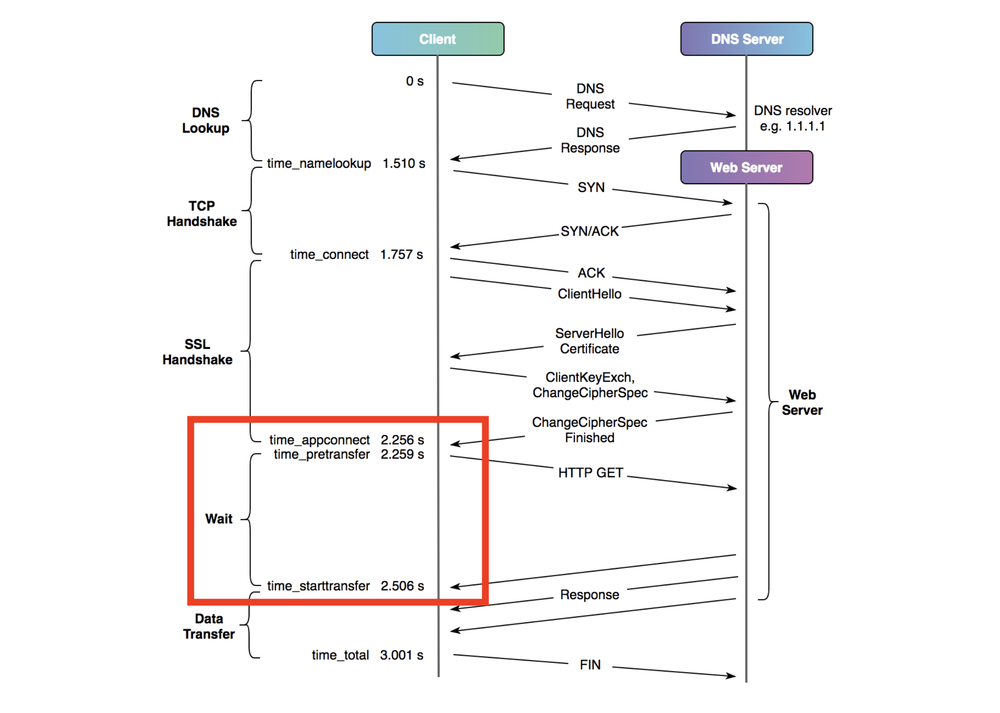

Timing web requests with cURL and Chrome
https://blog.cloudflare.com/a-question-of-timing/

---

同じネットワーク環境でかつ

`curl`の「`time_starttransfer - time_appconnect`」で比べる

---

ttfb.sh<br>
https://github.com/jaygooby/ttfb.sh

---

では計測

---

### VCL - 7ms

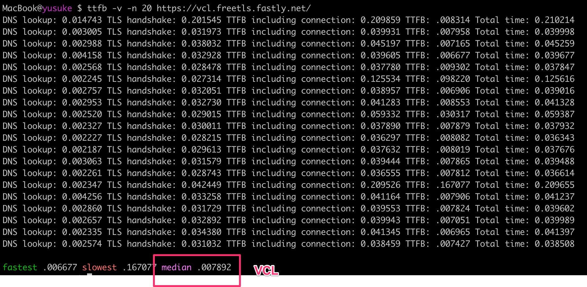

---

### Compute JS - 18ms

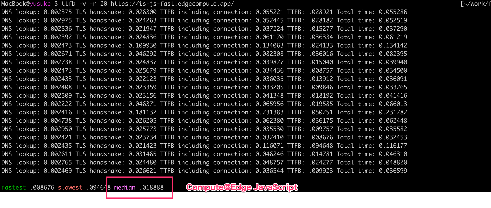

---

### Compute Rust - 12ms

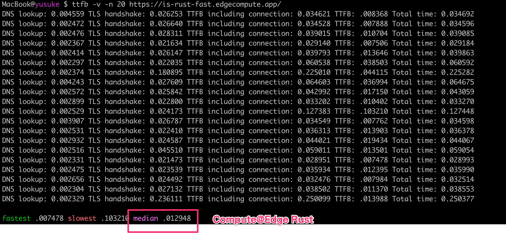

---

### 順位

1. VCL - 7ms
2. Compute Rust - 12ms
3. Compute JS - 18ms

---

何回計測しても順位は変わらず

結構差がついた

---

### 2. Compute@Edgeの実装別

* Hono
* itty-router

kwhitley/itty-router: A little router.<br>
https://github.com/kwhitley/itty-router

論理的にはHonoの方が格段に速い

---

オンラインだと差が出にくいので、ローカルサーバーを叩く

---

### Hono => 2054 Reqs/sec, 1.95ms

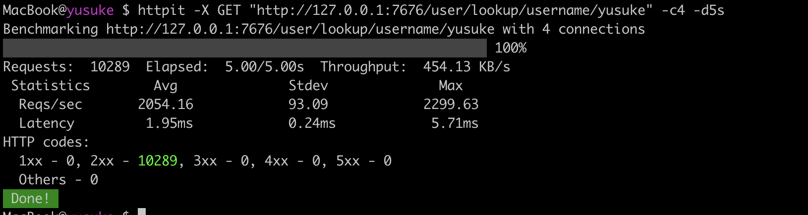

---

### itty-router => 1779 Reqs/sec, 2.25ms

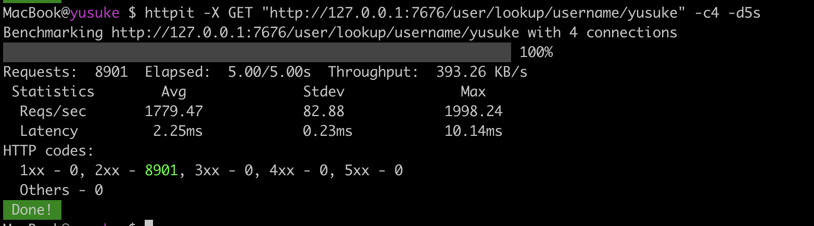

---

Compute@Edge同士ならややルーターで差が出る

---

## 性能まとめ

* VCL速い(Wasm/Lucetとの差？)
* ComputeでもJSよりRustの方が速い(Wasmにした時の違い？)
* JS同士ならルーターの性能差がでる

=> **Compute@Edgeが速くなって、Wasmにした時でもRustと同等になって、速いルーターを使えばよい**

---

以上、Compute@Edgeについて

1. 機能
2. 開発
3. 性能

---

「Compute@EdgeはVCLに置き換わるのか？」

---

# 評価

---

1. 機能 => ○
2. 開発 => ◎
3. 性能 => △

---

いわくら「（VCLだとプロパティ・関数の名称を）いちいち調べてる」

わだ「Compute@EdgeだとVSCodeで補完が効く」

いわくら「！！！！」

---

# まとめ

(パフォーマンスがVCLに近づけば)

「Compute@EdgeはVCLに置き換わる」

そして【VCL以上】の体験を手に入れる

---

正式リリースに期待！

* Rust - Limited Availability
* JavaScript - BETA

---

おしまい

---

トラベルブックではエンジニア募集中！

Fastlyガンガン使ってます

Compute@Edgeも導入するかもしれません！

---

TravelBook Tech Blog

https://tech.travelbook.co.jp/