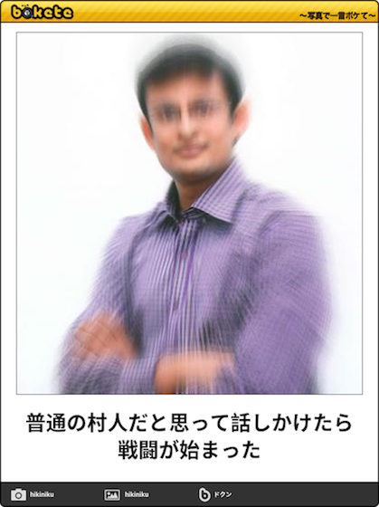
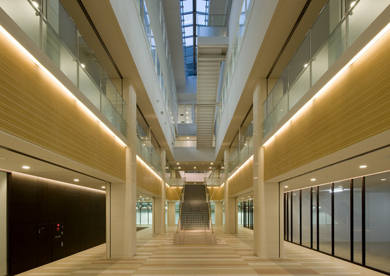
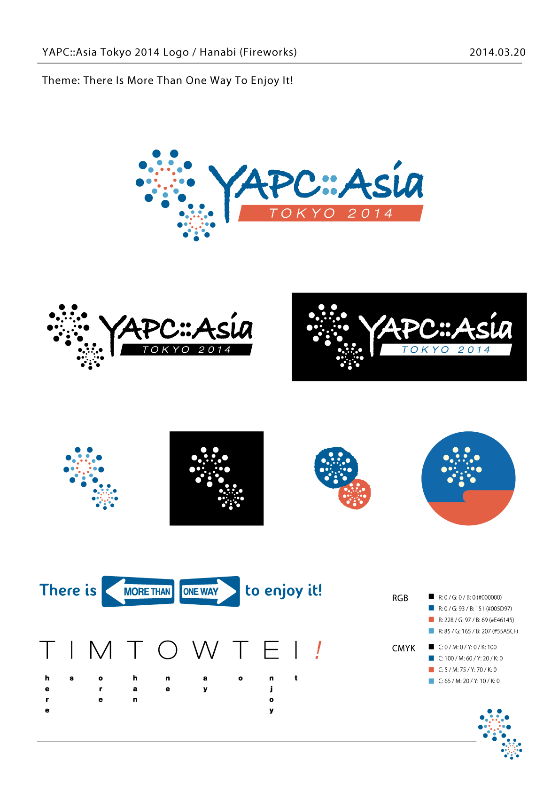
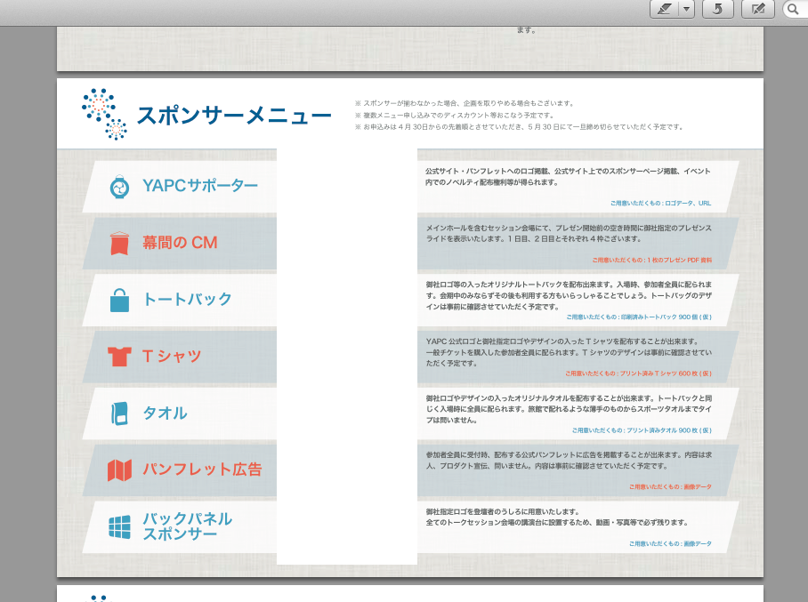
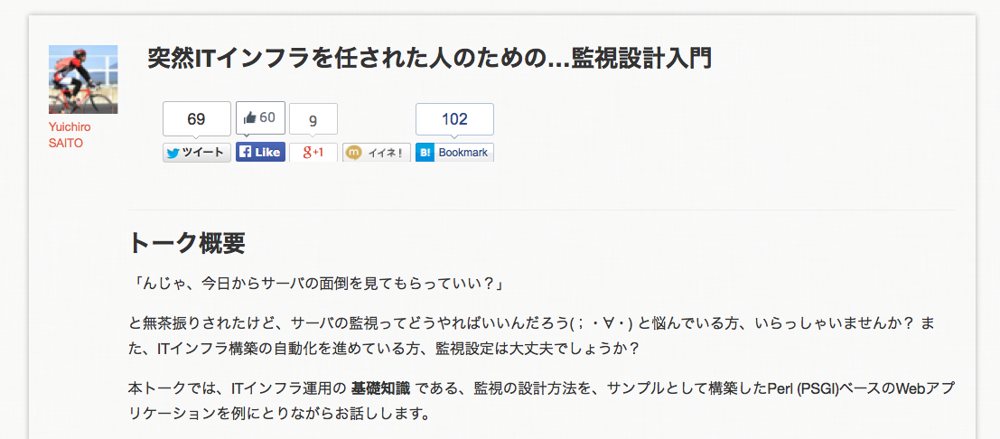
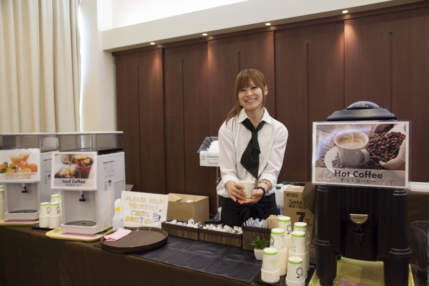
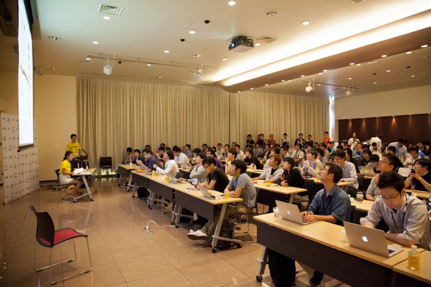
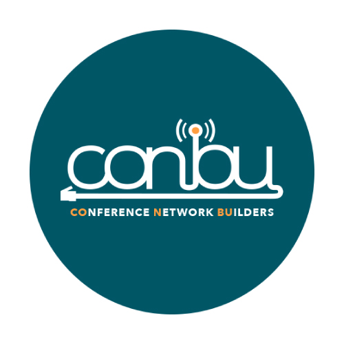
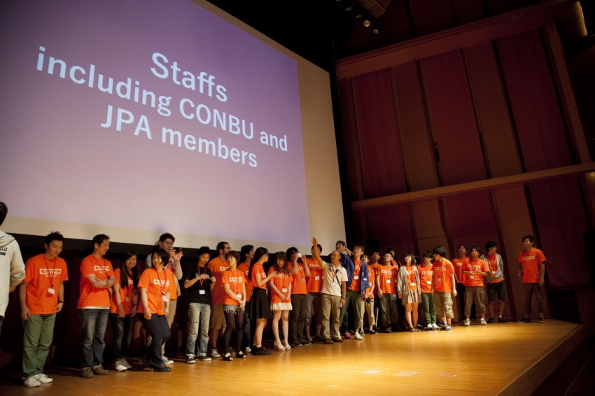
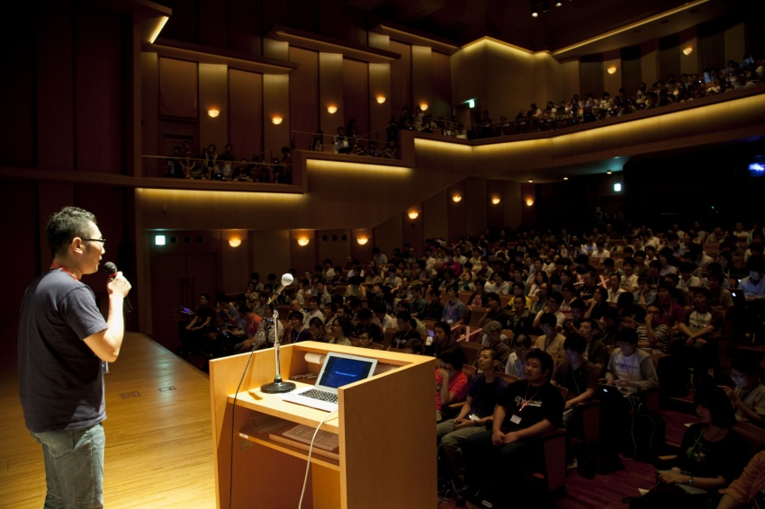

# **YAPC::Asia**をやってきた

<!-- .slide: data-background="#1c275c" -->

**Yusuke Wada** a.k.a. **yusukebe**

2014/09/20 Fukuoka.pm#25

---

## 自己紹介

- 和田裕介 / **@yusukebe**
- (株) ワディット代表取締役
- (株) オモロキ最高技術責任者兼取締役
- 写真で一言「**ボケて**」co-founder
- 著書「**Web サービスのつくり方**」技術評論社

---

### ボケて

---

## まさに題名通りの話をします

> 実行委員長として YAPC::Asia Tokyo 2014 を行った件

ただし...

---

## セルフ・ルポタージュ的に

<!-- .slide: data-background="#bf4c00" -->

来年の話はおいといて...

これまでのざっくばらんなタイムラインと共に綴る...

---

## 話は 2013 年 10 月へ遡り...

---

### YAPC::Asia Tokyo 2013 終了後

- 牧さん・櫛井さん引退
- 次回の YAPC をやりたい旨を牧さん含め色々な人に相談
- やることが決定

---

### 実行委員長及び JPA 理事に就任

> お金が絡んでくるので JPA として動いた方が良い

---

### 恐怖の登記処理!!

## **登記変更届**がマジ厄介

---

## 法務局 渋谷出張所

---

- 渋谷の法務局に**4 回**くらい通った
- はんこ屋に**3 回**行った
- **定款**超重要

> なんとか 11 月 1 日に JPA 理事就任

---

## YAPC への最初のアクション

> 会場の確保

---

### 前回と同じく慶應協生館を確保

- 9 月〜11 月は既に埋まっていた
- 前回の印象が良かった
- 慶應ということで個人的につながりがあった

---

---

## 2014 年 0X 月

とある 2 人と話してコンセプトを固めていく

- キャッチフレーズ
- 後に確定するイベントトラックの存在など

> **There is more than one way to enjoy it!**

---

## 2014 年 4 月/5 月

> 本格的に動き出す

---

- コアスタッフ招集
- コミュニケーションツールの確定
- デザイナーさんとの打ち合わせ
- 制作物第 1 弾デザイン依頼
- スポンサーメニューの作成
- メール営業
- Google スプレッドシートでの管理
- 予実管理
- 各スポンサーへの連絡
- Web サイトの立ち上げ

---

### コアスタッフ

- 事前からある程度動いてもらうスタッフ
- 去年まで深く関わっていた方が中心
- 当日は各オペレーションのリーダー役

---

### 大体こんな役割があった

- 制作物の発注
- Web サイト周り
- チケット
- 当日必要になる弁当やゴミ処理などの手配
- 当日オペレーションの準備

> とにかく経験を享受出来るのがありがたい

---

### コミュニケーションツール

- Facebook グループが中心
- 管理項目は Google スプレッドシート
- マニュアルは Google ドキュメント
- チケット管理として最後だけ GitHub Issues を使った

---

---

### 制作物のデザイン

- 元々 JPA と関わりのある「コバヤシさん」にお願い
- 一度顔合わせしてイメージをすり合わせた

> 今年は 8 月ですし、花火のモチーフなんてどーですか？！

---

---

### Web サイト

- 静的ページ/News ページは MovableType で構築
- トーク応募など動的な部分は Mojolicious アプリ
- フロントサーバでパスごとに rewrite

---

### スポンサー関係

- スポンサーメニューは去年を踏襲しつつシンプルに
- 値段を調整
- 例: バックパネルスポンサーの値上げ
- メール対応のみでスポンサードする企業が多かった

> YAPC と JPA のそもそものバリュー強し

---

---

---

### メール対応

- エンジニアにとって慣れない作業
- ひたすらメールを送っては返信してその後管理
- 例: ロゴを送ってもらう際など非同期に連絡が来る

---

### 予実管理

- お金が絡んでいる以上経営的判断は必要
- 独自の予実管理を導入
- 入と出を **予=予想 実=実績** で把握

---

### 収入

---

### 支出

---

### 2014 年 6 月

- チケット販売打ち合わせ
- チケット発売とトーク募集開始
- トーク採択決定

---

### チケット販売

- 実績から Peatix を採用
- 個人スポンサーの特典をリッチにして増やす策
- 販売期間が 1 ヶ月と短かったが無事目標枚数到達

---

---

### トーク応募と採択

- 倍率 2 倍程度と予想以上に応募が来た
- _about_ **Perl and Everything**
- インフラと多言語のトークが多い
- テスト関係のトークが 2 個だけだったのが印象的
- 実際に会場が盛り上がるかどうか？を想像して判断

> 結果比較的聴講者がバラける形になった

---

---

---

## イベントトラック

> ウズラさん担当

---

---

---

---

### 2014 年 7 月

- 制作物第 2 弾デザイン依頼
- CONBU チーム
- 制作物作成

---

### Booking.com とのやりとり

- 牧さんに助けてもらいつつ自分で英文メール
- スポンサーについては直接電話も...
- まさかのスピーカー 2 名追加 (Sawyer 合わせて 3 名)

---

---

### CONBU チーム

- 去年の YAPC ネットワークチームが元となって結成
- カンファレンスのネットワークを構築するボランティア軍団
- 事前から KMD/WIDE の加藤教授と協生館含んで打ち合わせ

> 今年は協生館から一度も怒られなかった...

---

### 当日必要な制作物

- パンフレット
- パンフレットに折り込む紙
- ストラップ
- 各種 T シャツ
- パーカー
- 幕間の CM データ
- etc.

---

### 難しい点

- スポンサーからデータをもらわないと動けない場合
- デッドラインが迫っている

> 納期の早い印刷屋などで対応

---

### 2014 年 8 月

- 会場見学
- 消防署への催し物開催届け出
- イベントスタッフ募集と懇親会
- スポンサー決定へ向けて
- 当日オペレーション計画
- マニュアルの作成
- 前夜祭準備

---

### イベントスタッフ

- 当日手伝ってくれるスタッフ
- 京都から参加してくれた方もいた！
- コアスタッフが各持ち場のリーダーとなり指示を出す

---

---

### オペレーションとマニュアル

- コアスタッフと共に当日の運用を詰める
- 4P くらいのマニュアルに落としこむ
- おそらくマニュアルをつくる作業自体が重要？

---

### 前夜祭前の準備

- 12 時から 14 時指定で荷物を受取る
- コアスタッフの指示のおかげで順調に
- 例: T シャツたたみやノベルティ詰め

---

### 当日

> 盛況

ただし... キャパオーバーは否めなかった

---

<!-- .slide: data-background="#bf4c00" -->

### 結果

# 1,361 人

---

---

### Blog まだだから YAPC 終わってない件

- YouTube への動画アップ
- 反省会
- 来年について
- etc.

---

<!-- .slide: data-background="#007399" -->

ちなみに...

### YAPC は...

> Yet Another Perl Conference

### つまり...

---

#### 以上今年の YAPC についてのセルフ・ルポタージュ

(来年はどーなる！？)
