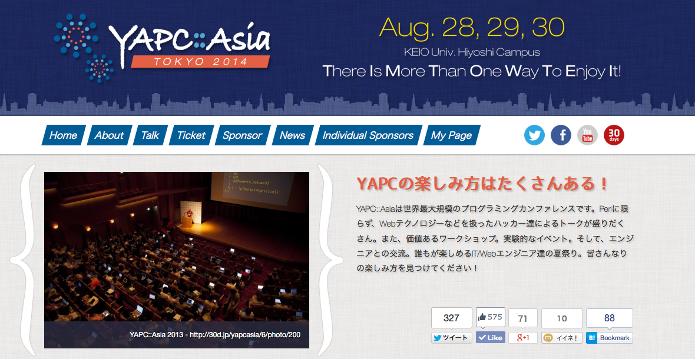
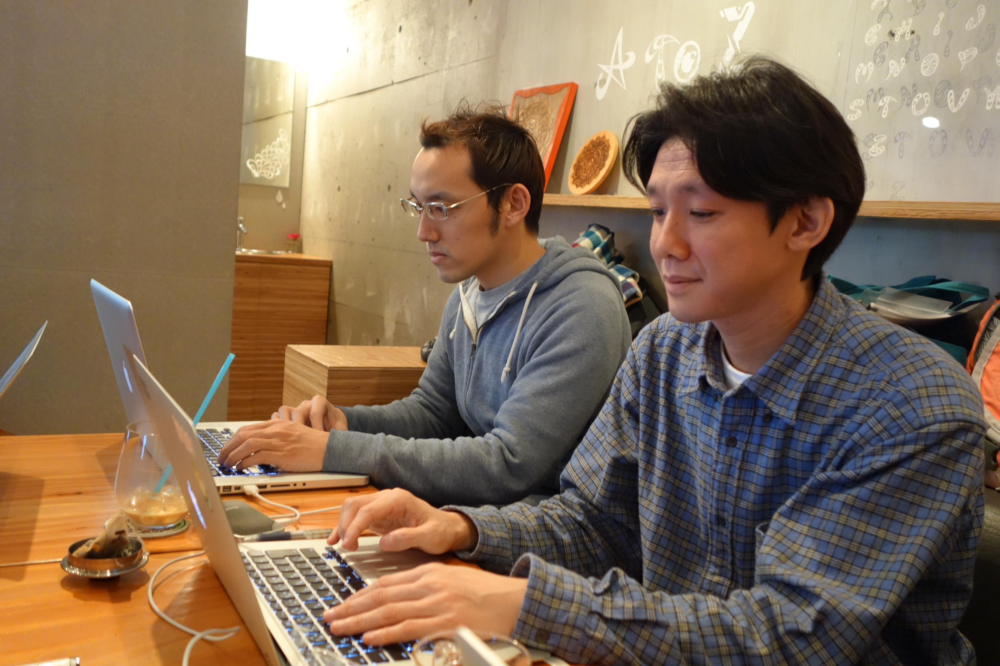
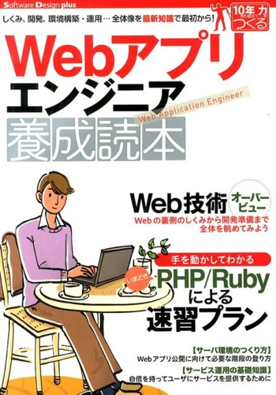

### YAPC::Asia Tokyo 2014

### 8 月 28 日〜30 日開催！



---

# Acme::Koemu

## All about koemu.

_2014 年 6 月 14 日_

---

## 自己紹介

- 和田裕介 a.k.a. yusukebe
- Web Application Developer

---

# こえむと私

---

## ハチイチ忘年会


_ハチイチ忘年会#07_ より

---

## 執筆



_執筆ハッカソン_ より

---

### Web アプリエンジニア養成読本



---

今日はめでたいので...

**こえむのプログラム**をつくりました！

---

    $ perldoc -t Acme::Koemu

---

## SYNOPSIS

```
use Acme::Koemu;
use feature qw/say/;
my  $koemu = Acme::Koemu->new();
say $koemu->name();
```

---

# METHODS

---

## name

こえむの英字ニックネームを返します。

    $koemu->name();

---

## is_drunk

こえむはお酒が大好き。それに加えて酔っ払っているとしつこいので、その状態を真偽値で判断します。

    say '落ちつけ！'
        if $koemu->is_drunk();

---

## go_to_party

こえむが飲みに行きます。引数に飲み会での役割を文字列で与えるとその通りキッチリ仕事する場合があります。

    $koemu->go_to_party();

---

## love

こえむには愛する人がいます。引数にその人の名前を与えると、果たして本当に**LOVE**なのか？を真偽値で判断します。

    $koemu->love('誰かさん');

---

## Let's live-conding !
