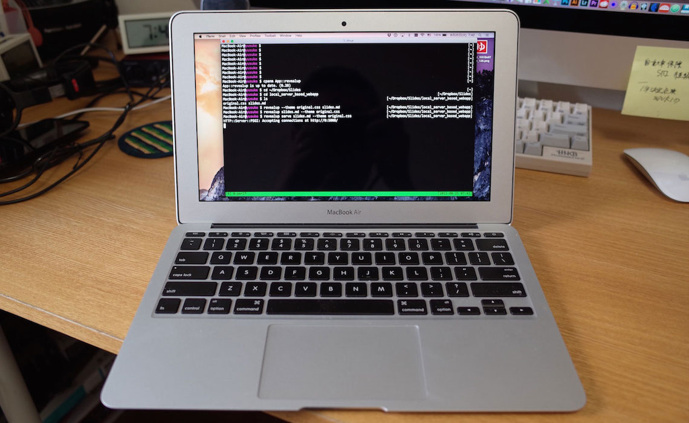
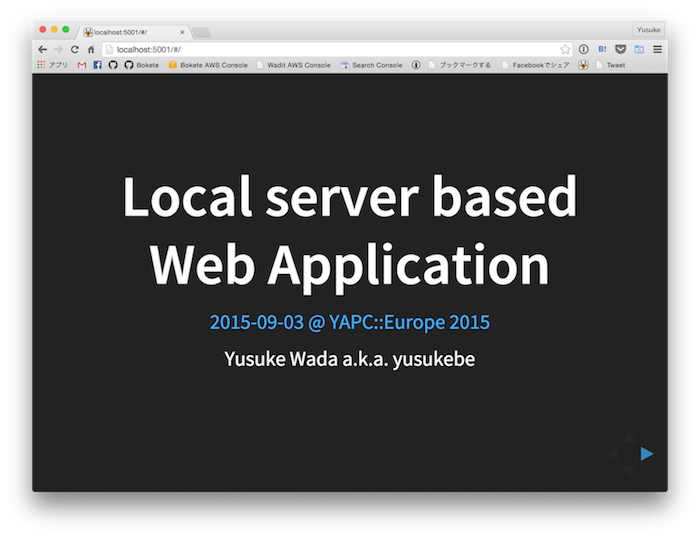
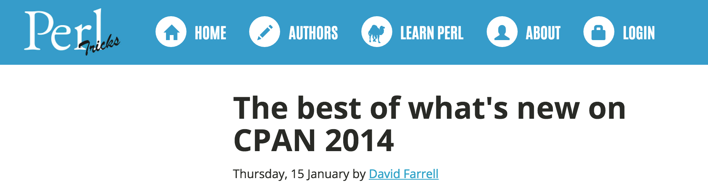
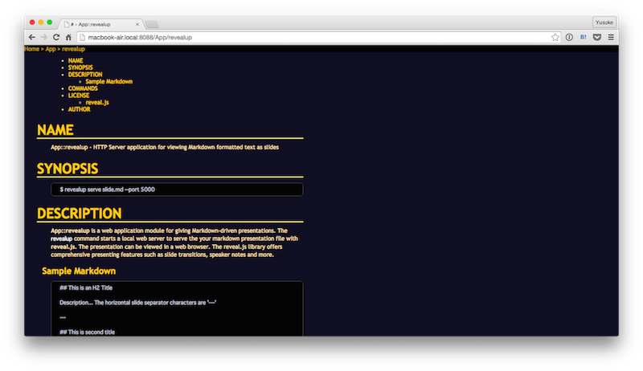
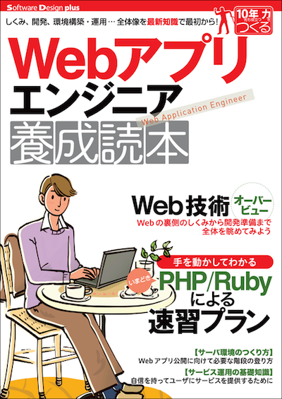

# Local server based Web Application

[2015-09-03 @ YAPC::Europe 2015](http://act.yapc.eu/ye2015/talk/6006)

Yusuke Wada a.k.a. yusukebe

---

# My name is...

---

# **yusuke**

---

# BUT

---

# Some people speak English

---

# Call me...

---

# yusu**key**

---

# I'm not yusuke**y**

---

# I'm yusuke

---

# Call me yusu**ke**

---

## I'm...

- Yusuke Wada
- Web application developer in Japan
- `search.cpan.org/~yusukebe`
- `twitter.com/yusukebe`
- `github.com/yusukebe`

---

> I'll talk about the fun of "**Local server based Web Application**" and how to make it!

---

## What does "**Local server**" mean?

---

### Run on your own Laptop or Desktop



---

### Is accessed from your own Web Browser


---

# For example

---

## The application showing **this SLIDES!**

This application is...

- running on _my MacBook_
- accessed from _this web browser_

---

## `App::revealup`

**as a CPAN distribution!**

- <https://metacpan.org/release/App-revealup>
- <https://github.com/yusukebe/App-revealup>

---

## How to use `App::revealup`

---

## Install `App::revealup`

```
$ cpanm App::revealup
```

`revealup` command is available to use

---

# To make slides

---

## Write Markdown texts

```
## First title

This is text... **bold** *Italic*

* List object
* List object

The slide sparator charactors are `---`

```

_To separate pages, write 3 hyphens_

---

## Run the server

```
$ revealup serve example.md
```

---

## Open the local address

```
$ open http://localhost:3000
```

Then your favorite web browser will open

---

## Show your slides



---

## `revelup serve` - Options

- `-p` or `-port`
- `--theme`
- `--transition`
- `--width`
- `--height`

```
$ revealup serve example.md --theme moon.css --transition zoom
```

---

## Slides

- Very beautiful
- Cool transitions
- Writing is easy with Markdown

---

# **BUT**

---

# I **did not** implement these!!

- Rendering slides
- Cool transitions
- Markdown parser

---

# So..

---

# DONT BE MAD AT ME

`:-)`

---

App::revealup uses `reveal.js`

`reveal.js` is a JavaScript library for a presentation.

- Rendering slides
- Cool transitions
- Markdown parser

<https://github.com/hakimel/reveal.js/>

---

# But it's only **JS**

---

# So, we need `App::revealup`

---

## Wrapper of `reveal.js`

implementing these:

- Command line interface
- HTTP Server
- Distributing contents

---

### Slides-App with `reveal.js` as Local server based Web Application is...

## **App::revealup**

---

## A Blog **Perl Tricks** said...

---

### `App::revealup` is one of the best CPAN modules on 2014



<small>App::revealup enables markdown driven presentations with Reveal.js, by implementing a mini HTTP server.</small> I wrote about it (twice) and use it all the time, **highly recommended**.

---

## Other applications on the CPAN

_like App::revealup_

- `Pod::Server`
- `Gitalist`
- `Remedie`
- `PAD`

---

## Pod::Server

```
$ pod_server
```



---

## PAD

```
$ pad Static --port 3000
```


---

Local server based web applications are

## Just for your **localhost**

---

## How to make **local server based Web Appcalitions** ?

---

## `use CPAN modules;`

Introduce cool modules to make _local server based Web Applications_ **quickly** or **easily**

---

# Make it as a **Web Application**

---

## `Plack`

Toolkit for making Web application frameworks

- Mini Web server
- Handle HTTP Request
- Return HTTP Response
- Run under the PSGI spec

---

## Most easiest way...

---

## One liner web application

- use `plackup` and Plack Application

```
$ plackup -MPlack::App::Directory \
  -e'Plack::App::Directory->new->to_app'
```

---

## If you want to write a mini application

---

## `use Plack::Request`

- HTTP request object from PSGI env

```
my $app = {
    my $env = shift; # PSGI env
    my $req = Plack::Request->new($env);
    ...; # Make your response
    return $res;
};
```

---

> Using Plack is good for small web applications

---

# To rendering HTML

---

## `Text::MicroTemplate`

Micro template engine

- Inspired by `Mojo::Template`
- Not depends on `Mojolicious`

```
  <h2><?= $second_title ?></h2>
```

---

# Make it as a **CLI**

---

## `Getopt::Long`

Processor of commad line options

- Parse `@ARGV` to (key-value)s

---

## `Path::Tiny`

File path utilitis

- Get local file or directory path
- Read contents from the file
- Write contents to the file

---

## `File::ShareDir`

Resolve location of distribution shared files

- For upload modules as **CPAN distribution**
- Use with `Path::Tiny`

---

## `App::revealup` is using...

- `File::ShareDir`
- `Getopt::Long`
- `MIME::Types`
- `Path::Tiny`
- `Plack`
- `Text::MicroTemplate`
- `Try::Tiny`

---

## Wrap-up

Local server based Web Application...

- Very useful to use
- That's fun to make it
- Bridge **between the web and your desktop**

---

# One more application

---

# `App::mookview`

---

# 2 years ago...

---

> We wrote the **book** about "making web applications" !

---



---

## On working proccess...

- Using Markdown format is **good**
- Managing texts on GitHub is **good**

---

# **BUT**

---

## Viewing texts is **bad**

> There is **not** a good viewer for previewing this book

---

# We want to read texts as the **real book**

---

# So...

---

## I made it

- <https://metacpan.org/release/App-mookview>
- <https://github.com/yusukebe/App-mookview>

---

# DEMO

---

## Wrap-up again

**Local server based Web Application** is

- Running on your own PC
- Accessed from your own web browser

---

# I want to say...

---

# If **what you want** is not exist...

---

# You can make it

# **by yourself**

---

# That's **fun**!!

---

# Try making **local server based Web Applications!!**

---

# Thank you!!
