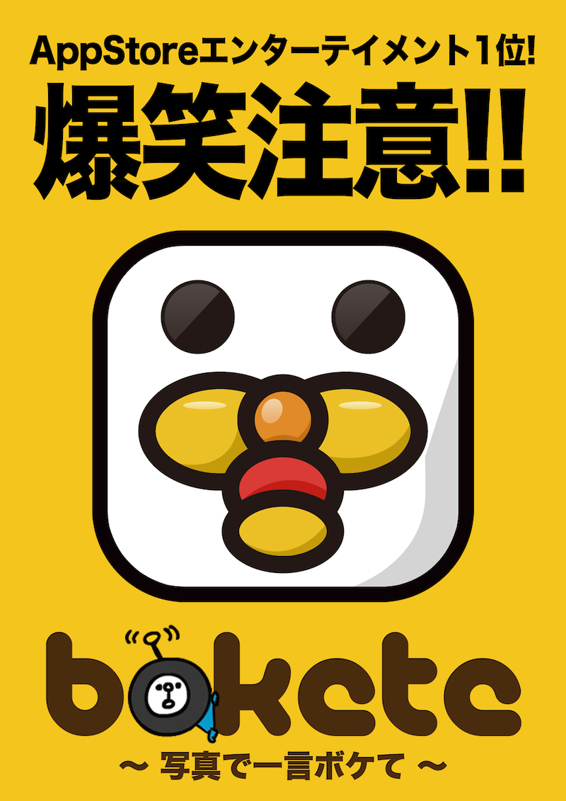
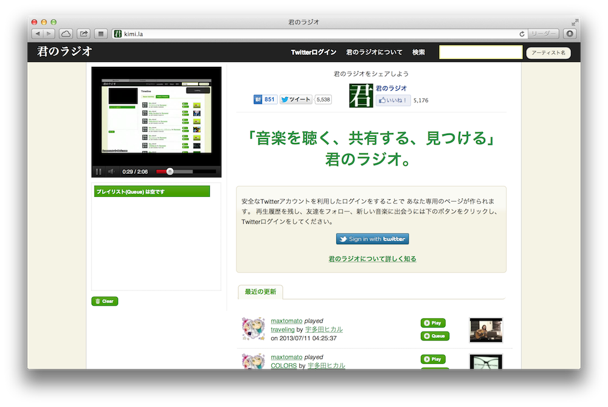
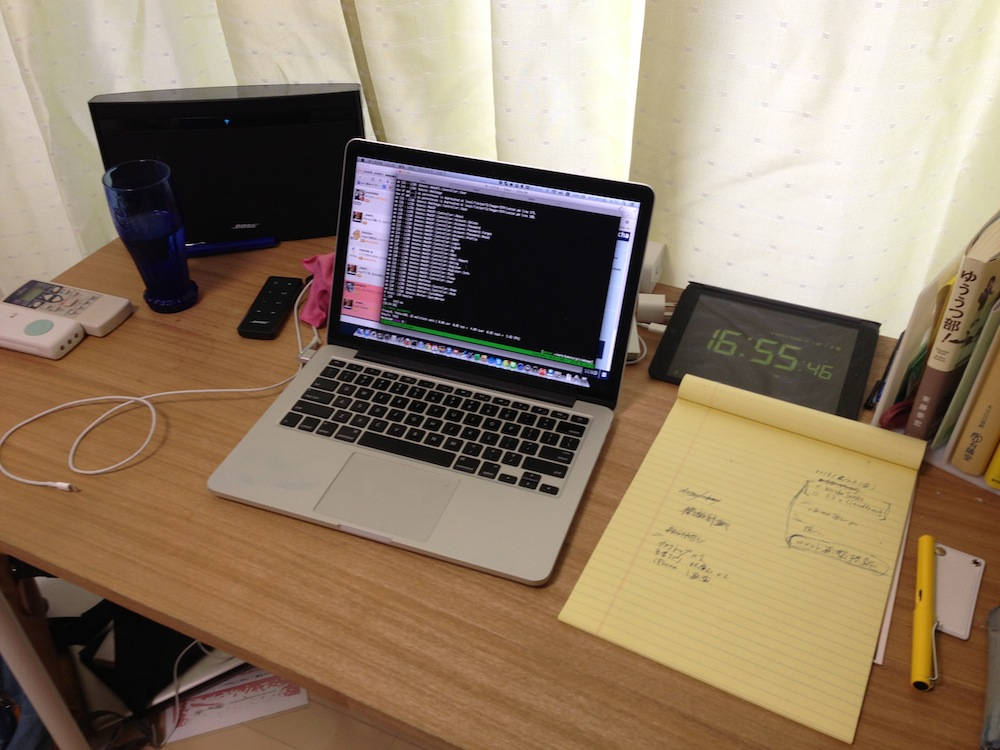
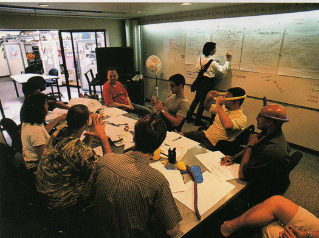
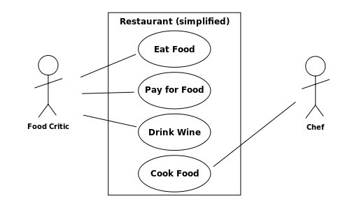
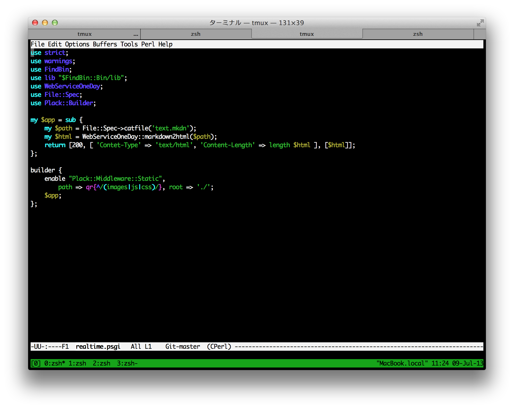
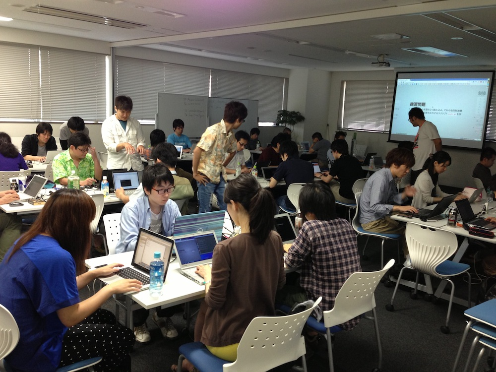
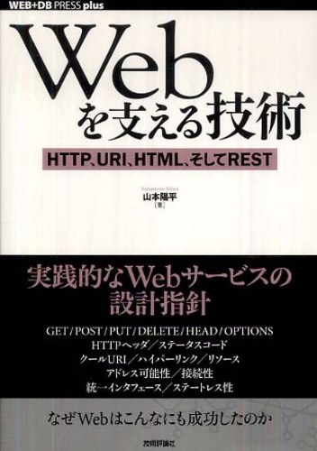
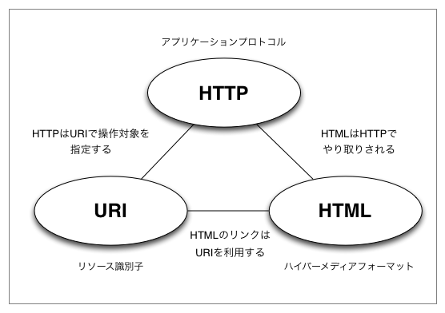

# 1日でわかるWebサービス制作の全て ～企画から実装まで～

[MarkeZine Academy 2013/07/23](http://event.shoeisha.jp/mza/20130723)

by [Yusuke Wada a.k.a yusukebe](http://yusukebe.com/)

---

## イントロダクション

---

### 自己紹介

- 和田裕介 / Yusuke Wada
- 1981年生
- (株) ワディット代表取締役
- (株) オモロキ取締役兼最高技術責任者
- Web Application Developer
- 物書きも少々

---

### ワディット


---

### オモロキ

---

### メインワークその1



---

### メインワークその2


---

### その他つくったモノ

- [君のラジオ](http://kimi.la/)
- anpiレポート
- CDTube

---

### [君のラジオ](http://kimi.la/)



---

### anpiレポート


---

### CDTube


---

## ボケて（bokete）

---

### 現状

- 全デバイス合計 月間「1億PV以上」
- スマホアプリ合計 170万ダウンロード
- hao123、 Yahoo! JAPANと連携
- コンテンツ書籍化 x 2回
- 各種企業様とコラボ

---

### 歩み


---

## 本題「Webサービスをつくるに当たって」

---

### Webサービスの定義

訪問者に対して何かしらの *サービス* を提供するWeb

- HTTPを応用してSOAP/XMLなどを使ったメッセージ送受信することもWebサービスと呼ばれる
- 動的なWebサイト
- アクセスされた状況に応じてページが変化する
- 連動するスマホアプリもその一環

---

### 事例紹介「クックパッド」


---

### 事例紹介「nanapi」


---

### サービスを提供する＝ユーザーがいる

- いわゆる「B to C」の「C」
- より多くのユーザーに使ってもらうこと
- ユーザーの体験を充実させること
- この2つが指標になる

---

### 個人や小さな規模からも始められる

- オモロキの社員は4人
- その他パートナーと組んで開発・運用
- イニシャルコストが低い
- 個人でもWebサービスをつくって認知させることは可能
- 興味が多様化しているのでニッチなモノでも成り立つ

---

### 得られること

1. 勉強になる
2. 2枚目の名刺として
3. ユーザーの反応が楽しい
4. もしかしてお金になるかも…

---

### 嬉しい瞬間

> 「あのサービスをつくったゆーすけべーさんですよね？」

---

### 6畳一間から世界を変える



---

### 肝に銘じたい言葉

> Shut the fuck up and write some code.

---

### 例えば…

- Twitter上から「おはよう」が含まれるツイートを解析
- アイデアの元
- 簡単なプログラムを動かすことで検証が出来る

---

### twitter_search.pl

	use Net::Twitter::Lite::WithAPIv1_1;
	use Config::Pit;
	use Encode;
	use utf8;

	binmode STDOUT, ':utf8';

	my $config = pit_get('twitter-api');
	my $nt	 = Net::Twitter::Lite::WithAPIv1_1->new(
		consumer_key		=> $config->{consumer_key},
		consumer_secret	 => $config->{consumer_secret},
		access_token		=> $config->{token},
		access_token_secret => $config->{token_secret}
	);
	my $result = $nt->search(
		{
			q				=> 'おはよう',
			include_entities => 1,
			result_type	  => 'recent',
			count			=> 100
		}
	);

	for my $tweet ( @{ $result->{statuses} } ) {
		print "$tweet->{text}\n";
		print "----------------------------------------\n";
	}

---

### とにかく手を動かすことが大事

> そこに1,000人いたとして、アイデアを思いつくのが100人、アイデアを実現するのが10人、アイデアで成功する人は1人

---

## 企画と開発準備

---

### つくり方をつくる

- モノをつくるための方法を自分なりにつくる
- 参考になる本
  - [IDEO 「発想する会社」](http://www.amazon.co.jp/dp/415208426X/)
  - [デザイン思考の道具箱](http://www.amazon.co.jp/dp/4152087994/)
  - [仕事のやり方間違えています](http://www.amazon.co.jp/dp/4396612117/)
  - [アイデアのつくり方](http://www.amazon.co.jp/dp/4484881047/)

---

### デザイン思考の道具箱


---

### 創造のサイクルを回せ


---

```
1. 哲学
  - 個々人が持つある興味に対する揺るがない信念
2. アイデア
  - 哲学を叶える個別具体的なアイデア
3. テーマ
  - 勝負する領域
4. コンセプト
  - アイデアを束ねるつくるモノを一言で表すような枠組み
5. 名前
  - これが無くては始まらない。キラキラネームかセルフトーキングか
6. デザイン
  - 見た目のみならず、ディテールを妥協して決めていく作業
7. 内部設計
  - 実装に向けてのシステムの内側を設計する
```

---

### 例えば…

[クックパッド](http://cookpad.com/) の場合…

---

### アイデアとコンセプトの違い

- アイデアはいくつも出てくる
- それをまとめるフレームワークみたいなのがコンセプト

> 例: ボケては「写真で一言ボケる」Webサービス

---

### アイデアは組み合わせ

> アイデアとは既存の要素の新しい組み合わせ以外の何のものでもないということである

> 「アイデアのつくり方」より

---

### シャワーを浴びている時に降ってくる

- アイデアはすぐに出てくるものでは無い
- 孵化する直前までいかに追い込むかが重要
- その後はリラックスしていると不思議と出てくる

---

### シーズとニーズの話

- これが出来るという「シーズ」
- これが欲しいという「ニーズ」
- どちらも知っている必要はある
- が、偏ってもいけない

---

### 究極のブレインストーミング



[7 Ways to Unleashing your Creativity](http://www.designsojourn.com/7-ways-to-unleashing-your-creativity/) より

---

### ブレストにはルールがある

- 否定をしない
- むしろ乗っかかる
- 時間を決める
- 数を数える
- 突飛なことを言う
- まとめる役割

---

### リスク、リスク、リスク

> そにはリスクが潜んでいる


- スキルリスク
- 技術リスク
- 政治リスク
- 法的リスク

---

### ユースケースによる要求定義



---

### 開発の準備をしよう

「企画倒れ」にならないよう開発へのハードルを下げていく

> やるやる詐欺にはなりたくない

---

### エディタという道具

> これはemacsです！



---

### 勉強会



---

### 巨人の肩に乗る

> Standing on the shoulders of giants

CPANライブラリのエコシステム

- [Where are Casual Perlers ?](http://yusukebe.com/archives/20090912/120113.html)
- [On module writers and users](http://bulknews.typepad.com/blog/2009/09/on-module-writers-and-users.html)

---

## Webテクノロジー・オーバービュー

---

### Webの基礎技術を学びながらつくる

オススメ本



---

### ホームページをブラウザで閲覧する際の裏側


このやり取り自体が取り決め＝ *プロトコル* として定められている

---

### HTTP、URI、HTML



> あくまで取り決めなので「そういうモノ」として捉える

---

### URI / URL

>  http://example.com/about.html

- プロトコルに「HTTP」を使用する
- ホスト名は example.com
- パスが /about.html
- 拡張子が.htmlなので大抵HTMLである

---

### HTTPのメソッド

クライアントからサーバへのリクエスト。リソースを扱うため、主に4つが使われている

- GET
- POST
- PUT
- DELETE

---

### telnetでGET

	$ telnet yusukebe.com 80

	GET / HTTP/1.1
	Host: yusukebe.com
	
---

### Webページを構成する要素

- HTML
- CSS
- JavaScript
- 画像、Flashなどのバイナリファイル

---

### HTML - HyperText Markup Language

ある程度構造化したテキストをマークアップで書ける

	<h2 class="title">タイトル</h2>

---

### CSS - Cascading Style Sheets

CSSセレクタを利用しHTMLを装飾する

	h2.title { color:#333; }

---

### JavaScript

ページ自体をブラウザ側で操作し動きを与える

	$('h2.title').fadeOut();

---

### 動的サイトと静的サイト


---

### Webプログラミング言語

- PHP
- Perl
- Ruby
- Python
- Java

などが主流であるが C言語 でも不可能ではない

---

### Web Application Framework

> 例えば、Ruby on Rails

---

### それ以前


---

### MVCモデル

- Model
- View
- Controller

> 役割を分離して考えておくとよいよねぇ〜

---

### Webサーバ、ミドルウェア色々

- Apache
- nginx
- MySQL
- memcached
- Redis
- MongoDB

---

### クラウドとしてのAWS

- Amazon Web Services
- ボケてでは現在30台ほどのサーバを利用
- 10分でスケールアウトすることが可能
- マネージドされたミドルウェアを使える
  - S3 / CloudFront
  - RDS
  - ElastiCache
  - SES

---

## ライブコーディングその1

---

### なんかつくります！

> 例: Twitterログイン掲示板

---

### いつつくるの？

> 今でしょ！

---

## 開発の実際

---

### 3種の神器

- ターミナル
- エディタ
- ブラウザ

---

### レポジトリとしてのGit

- コードのバージョン管理システム
- clone/commit/push/pull/merge

---

### GitHub


---

### 流れ

1. コードを書く
2. テストを書く（最初に書くケースも）
3. 実行する
4. ブラウザで確認する
5. commit/push

---

### デプロイ

- 手元のOSX = 開発環境
- テスト/ステージング/本番
- デプロイツールで自動化

---

## 開発言語的な...

---

### use Perl

- 25歳/ラリー・ウォールさんによる
- テキスト処理に強い言語
- Ruby/Python/PHPに押されがちだけど…
- Webもテキストみたい ＝ Webにも強い
- Perl5の最新安定バージョンは 5.18.0

---

### TMTOWTDI


> やり方はひとつじゃない

---

### 実はこの資料もPerlでHTML化!!!

- Markdown でテキストを編集
- 手元にてリアルタイムでプレビューするWebアプリ
- 変換スクリプトでHTML化
- GitHub Pagesで公開
- [WebServiceOneDay.pm](lib/WebServiceOneDay.pm)
- [convert.pl](examples/convert.pl)

---

### CPANライブラリ


---

### WebServiceOneDay.pm

	package WebServiceOneDay;
	use strict;
	use warnings;
	use Text::Markdown qw/markdown/;
	use Path::Class qw/file/;
	use Encode qw/decode_utf8/;
	use Data::Section::Simple qw/get_data_section/;
	use Text::MicroTemplate qw/render_mt/;

	…;

---

### Perl Mongers !!


---

## Web Application Framework

---

### Mojolicious

- MVCのうちVCをサポート
- Perlコアモジュールのみに依存  = ポータブル
- いわゆるフルスタックではない
- 自前で最小限全てを実装している意味ではフルスタック
- その他CPANモジュールを組み合わせる
- 最新バージョンは 4.18

---

### スケルトン

	$ mojo generate app MyApp::Web
	
すると… 
	
	$ tree ./
	
	./
	├── lib
	│   └── MyApp
	│  	 ├── Web
	│  	 │   └── Example.pm
	│  	 └── Web.pm
	├── log
	├── public
	│   └── index.html
	├── script
	│   └── my_app_web
	├── t
	│   └── basic.t
	└── templates
		├── example
		│   └── welcome.html.ep
		└── layouts
			└── default.html.ep

---

### ルーティング

	package MyApp::Web;
	use Mojo::Base 'Mojolicious';

	sub startup {
		my $self = shift;
		my $r = $self->routes;
		$r->namespaces(['MyApp::Web::Controller']);
		$r->get('/')->to('root#index');
	}

	1;

---

### コントローラ

	package MyApp::Web::Controller::Root;
	use Mojo::Base 'Mojolicious::Controller';

	sub index {
		my $self = shift;
		my $message = "Hello, I'm from Yokohama!";
		$self->stash->{message} = $message;
		$self->render();
	}

	1;

---

### テンプレート

	% layout 'default';
	% title 'Welcome';

	<h2><%= $message %></h2>

---

### さて

> なにをつくりましょうか！

---

## ライブコーディングその2

---

### データベースを扱う

- MySQLを使用
- リレーショナルデータベースの一種
- いわゆる「表」
- SQLによる問い合わせ
- データの抽出、結合

---

### テーブル構造

	mysql> select * from entry;
	+----+---------------+-----------+---------+---------------------+
	| id | title		 | body	  | user_id | created_on		  |
	+----+---------------+-----------+---------+---------------------+
	|  1 | This is title | Body Text |	   1 | 2013-07-23 14:00:00 |
	+----+---------------+-----------+---------+---------------------+
	1 row in set (0.00 sec)

---

### SQL文

	CREATE TABLE entry (
		id INT UNSIGNED AUTO_INCREMENT,
		title VARCHAR(255),
		body TEXT NOT NULL,
		user_id BIGINT UNSIGNED NOT NULL,
		created_on DATETIME NOT NULL,
		PRIMARY KEY (`id`)
	) DEFAULT CHARACTER SET 'utf8' engine=InnoDB;

	INSERT INTO entry
	(title, body, user_id, created_on)
	VALUES
	('This is title', 'Body Text', 1, '2013-07-23 14:00:00');

---

### O/R Mapper

- Object-relational mapping
- Rowオブジェクトとして扱う
- リレーションも面倒を見る？
- よりプログラムっぽくSQL発行

---

### 疑似コード

	$db->insert( 'entry',
		{ title => 'This is title', body => 'Body text' } );
	my $entry = $db->single( 'entry', { id => 1 } );
	say $entry->title; # This is title
	$entry->update({ title => 'Another title' });
	say $entry->title; # Another title
	$entry->delete();

---

### モデルをつくってコントローラから呼び出す

- 極力コントローラは薄く
- モデル単体で動作、テスト可能なように
- モデル内でO/R Mapperを扱うことを推奨

---

### コントローラにて

	sub index {
		my $self = shift;
		my $entries = $self->model('Entry')->get_recent_entries({}, {
			order_by => 'id DESC', page => 1
		});
		$self->stash->{entries} = $entries;
		$self->render('index');
	}

---

### CLI

- コマンドラインインターフェース
- cron や デーモンとして実行する
- いわゆるバッチ処理
- ジョブキュー
- vs Webアプリ

---

### バリデーション

- フォームの入力値の検証
- 例えば、それが郵便番号っぽいか？
- 適切なエラーメッセージを表示してあげる

---

### フロントエンドを実装する

- 最小限のライブラリで楽をする
- jQuery
- CSS Framework

---

### テスト

- プログラムが望む挙動をしているか？を担保する
- テストコードが自動で「緑」か「赤」かを判断

TAP

	ok $model->get_entry({ id => 1 });

---

### プロビジョニング例

- VPS もしくは AWS という選択肢
- フロントエンド - nginx
- アプリケーションサーバ - Starman / Starlet
- DBサーバ - MySQL
- キャッシュサーバ - memcached

---

## 今回紹介しなかったこと

---

###  セキュリティ

- Mojoliciousのセッション
- エスケープ関係諸々
- CSRF対策
- サーバのセキュアな運営

---

### デプロイの実践

- サーバ設定
- デプロイツール
- 監視

---

## まとめ

- Webサービスをつくるための心得
- 企画と設計
- Webのテクノロジー
- 実際につくってみた

