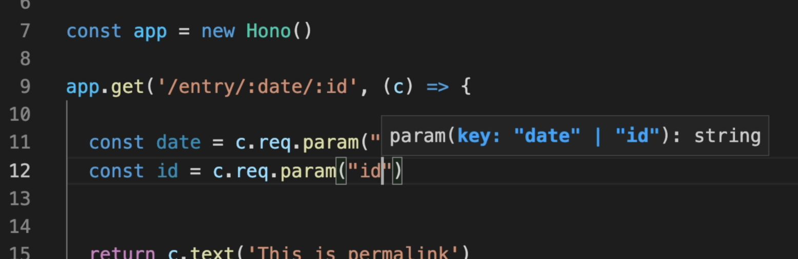

# Hono\[炎\] Ultrafast web framework for Cloudflare Workers.

Yusuke Wada

YAPC::Japan::Online 2022

---

## Talk about:

1. Cloudflare Workers
2. Hono

---

## Introduction

---

### `Initial commit`

2021-12-15


---

### Current version

`v0.5.0`

---

### TODO


---

### TODO 2


---

### Contributors


---

## Cloudflare Workers

---

Cloudflareの**CDNエッジ**で実行される**サーバーレス**環境

---

### 速い・短い・小さい

* コールドスタートなし
* CPU時間50ms(Bundled)
* 1MB以内

---

* Workers KV
* Workers Durable Objects
* Workers Sites
* Cache API
* CDNのキャッシュコントロール

---

## Use-case

---

### 1.PC/SPの振り分け

```js
let isMobile = false
const userAgent = request.headers.get("User-Agent") || ""
if (userAgent.match(/(iPhone|Android|Mobile)/)) {
  isMobile = true
}

const device = isMobile ? "Mobile" : "Desktop"

const cacheUrl = new URL(request.url + "-" + device)
const cacheKey = new Request(reqeust.url + device, request)
const cache = caches.default

let response = await cache.match(cacheKey)
```

---

### 2.Slackスラッシュコマンド

```js
const karma = async (name: string, operation: string) => {
  const key = PREFIX + name
  const karm = await KV_KARMA.get(key)

  if (operation == "++") {
    karma = karma + 1
  } else {
    karma = karma - 1
  }
  await KV_KARMA.put(key, karma)

  return `${name} : ${karma}`
}
```

---

### 3.ブックマークアプリ


---

## Worker

---

* Node.jsではない
* APIが限られている

---

## Service Worker API

```js
const handleRequest = async (request) => {
  return new Response("Hello YAPC!")
}
addEventListener("fetch", event => {
  event.respondWith(handleRequest(event.request))
})
```

---

## API

* Encoding
* Fetch / FetchEvent
* HTMLRewriter
* Headers
* Request / Response
* Streams
* Web Crypto
* Web standards
* WebSockets
* Cache / KV / Durable Objects

---

## Perlでも書ける

`Perlito`

```perl
JS::inline('addEventListener("fetch", event => { p5cget("main", "listener")([event]) })');
```

---

```perl
sub handleRequest {
    my ($req) = @_;

    # URL is JavaScript Object
    my $url = URL->new($req->url);
    my $query_string = $url->search;

    # Headers is JavaScript Object
    my $headers = Headers->new();
    $headers->append($key, $v);

    # Response is JavaScript Object
    my $res = Response->new(
        $msg, { status  => 200, headers => $headers }
    );
    return $res;
}
```

---

Fastly Compute@Edgeでも同じコードが動くことがある

---

## Wrangler

* 開発〜デプロイ
* `wrangler dev`
* `wrangler publish`

---

## miniflare

* Yet Anotherな実装
* Wrangler@2.0の内部で使われている

---

## Hono\[炎\]

Ultrafast web framework for Cloudflare Workers.

---

```js
import { Hono } from 'hono'
const app = new Hono()

app.get('/', (c) => c.text('Hono!!'))

app.fire()
```

---

## Hono in 1 minute


---


```sh
$ yarn init -y
$ wrangler init
$ touch index.js // Write code
$ wrangler publish
```

`{project-name}.{user-name}.workers.dev`

---

### モチベーション

「Webサイトを作ろうとしていたら、フレームワークを作っていた」

---

### 他にも

* itty-router
* Sunder
* worktop

---

### アイデンティティを探す旅へ

---

## Features

---

* **Ultrafast**
* Zero dependencies
* Middleware
* Optimized

---

## Ultrafast

---

### TrieRouter

---

### ベンチマーク

```plain
hono x 779,197 ops/sec ±6.55% (78 runs sampled)
itty-router x 161,813 ops/sec ±3.87% (87 runs sampled)
sunder x 334,096 ops/sec ±1.33% (93 runs sampled)
worktop x 212,661 ops/sec ±4.40% (81 runs sampled)
Fastest is hono
```

---

### Utrafast!

---

### RegExpRouter

---

```plain
hono x 723,504 ops/sec ±6.76% (63 runs sampled)
hono with RegExpRouter x 934,401 ops/sec ±5.49% (68 runs sampled)
itty-router x 160,676 ops/sec ±3.23% (88 runs sampled)
sunder x 312,128 ops/sec ±4.55% (85 runs sampled)
worktop x 209,345 ops/sec ±4.52% (78 runs sampled)
Fastest is hono with RegExpRouter
```

---

### Utrafast!!!

---

Compared to other `node.js` routers

---

* find-my-way => Framework independent ✓
* trek-router => Regex ✗ Multi-parametric route ✗
* hono RegExpRouter => Regex ✓ Multi-parametric route ✓

```plain
find-my-way benchmark x all together: 1,059,323 ops/sec
trek-router benchmark x all together: 1,439,378 ops/sec
hono RegExpRouter benchmark x all together: 1,426,009 ops/sec
```

---

## Why so fast?

---

### TrieRouter

Inspired by **goblin**.

* [bmf-san/goblin: A golang http router based on trie tree.](https://github.com/bmf-san/goblin)
* [bmf-tech - GolangでgoblinというURLルーターを自作した](https://bmf-tech.com/posts/Golang%E3%81%A7goblin%E3%81%A8%E3%81%84%E3%81%86URL%E3%83%AB%E3%83%BC%E3%82%BF%E3%83%BC%E3%82%92%E8%87%AA%E4%BD%9C%E3%81%97%E3%81%9F)


---

Trie Tree

```js
class Node<T> {
  method: string
  handler: T
  children: Record<string, Node<T>>
}
```

---

### RegExpRouter

Inspired by **Router::Boom**.

[Introduce RegExpRouter #109](https://github.com/yusukebe/hono/pull/109) by @usualoma

---

All the routes into one RegExp object.

* /help
* /:user_id/followees
* /:user_id/followers
* /:user_id/posts
* /:user_id/posts/:post_id
* /:user_id/posts/:post_id/likes

```plain
^/(?:help$()|([^/]+)/(?:followe(?:es$()|rs$())|posts(?:/([^/]+)(?:/likes$()|$())|$())))
```

---

Hono is Fast.

---

## API

---

## `app`

* app.HTTP_METHOD(path, handler)
* app.all(path, handler)
* app.route(path)
* app.use(path, middleware)
* app.notFound(handler)
* app.onError(err, handler)
* app.fire()
* app.fetch(request, env, event)

---

## Routing

---

### `app.HTTP_METHOD` / `app.all`

```js
// HTTP Methods
app.get('/', (c) => c.text('GET /'))
app.post('/', (c) => c.text('POST /'))

// Wildcard
app.get('/wild/*/card', (c) => {
  return c.text('GET /wild/*/card')
})

// Any HTTP methods
app.all('/hello', (c) => c.text('Any Method /hello'))
```

---


### Named Parameter

```js
app.get('/user/:name', (c) => {
  const name = c.req.param('name')
  ...
})
```

---




[Added type to c.req.param key. #102](https://github.com/yusukebe/hono/pull/102) by @usualoma

---

### Regexp

```js
app.get('/post/:date{[0-9]+}/:title{[a-z]+}', (c) => {
  const date = c.req.param('date')
  const title = c.req.param('title')
  ...
```

---

### Nested route

```js
const book = app.route('/book')
book.get('/', (c) => c.text('List Books')) // => GET /book
book.get('/:id', (c) => {
  // => GET /book/:id
  const id = c.req.param('id')
  return c.text('Get Book: ' + id)
})
book.post('/', (c) => c.text('Create Book')) // => POST /book
```

---

### no strict

If `strict` is set `false`, `/hello`and`/hello/` are treated the same:

```js
const app = new Hono({ strict: false })

app.get('/hello', (c) => c.text('/hello or /hello/'))
```

---

## async/await

```js
app.get('/fetch-url', async (c) => {
  const response = await fetch('https://example.com/')
  return c.text(`Status is ${response.status}`)
})
```

---

## Middleware

---

### Builtin Middleware

```js
import { Hono } from 'hono'
import { poweredBy } from 'hono/powered-by'
import { logger } from 'hono/logger'
import { basicAuth } from 'hono/basicAuth'

const app = new Hono()

app.use('*', poweredBy())
app.use('*', logger())
app.use('/auth/*', basicAuth({ username: 'hono', password: 'acoolproject' }))
```

---


### Available builtin middleware

* basic-auth
* body-parse
* cookie
* cors
* logger
* mustache
* powered-by
* serve-static

---

### Custom Middleware

```js
// Custom logger
app.use('*', async (c, next) => {
  console.log(`[${c.req.method}] ${c.req.url}`)
  await next()
})

// Add a custom header
app.use('/message/*', async (c, next) => {
  await next()
  await c.header('x-message', 'This is middleware!')
})

app.get('/message/hello', (c) => c.text('Hello Middleware!'))
```
---

## Error

---

### Not Found

```js
app.notFound((c) => {
  return c.text('Custom 404 Message', 404)
})
```

---

### Error Handling

```js
app.onError((err, c) => {
  console.error(`${err}`)
  return c.text('Custom Error Message', 500)
})
```

---

## Context

---

### c.req

```js
// Get Request object
app.get('/hello', (c) => {
  const userAgent = c.req.headers.get('User-Agent')
  ...
})

// Shortcut to get a header value
app.get('/shortcut', (c) => {
  const userAgent = c.req.header('User-Agent')
  ...
})

// Query params
app.get('/search', (c) => {
  const query = c.req.query('q')
  ...
})

// Captured params
app.get('/entry/:id', (c) => {
  const id = c.req.param('id')
  ...
})
```

---

### Shortcuts for Response

```js
app.get('/welcome', (c) => {
  c.header('X-Message', 'Hello!')
  c.header('Content-Type', 'text/plain')
  c.status(201)

  return c.body('Thank you for comming')
})
```

---

Same as:

```js
return new Response('Thank you for comming', {
  status: 201,
  statusText: 'Created',
  headers: {
   'X-Message': 'Hello',
    'Content-Type': 'text/plain',
    'Content-Length': '22'
  }
})
```

---

### c.text()

Render text as `Content-Type:text/plain`:

```js
app.get('/say', (c) => {
  return c.text('Hello!')
})
```

---

### c.json()

Render JSON as `Content-Type:application/json`:

```js
app.get('/api', (c) => {
  return c.json({ message: 'Hello!' })
})
```

---

### c.html()

Render HTML as `Content-Type:text/html`:

```js
app.get('/', (c) => {
  return c.html('<h1>Hello! Hono!</h1>')
})
```

---

### c.redirect()

Redirect, default status code is `302`:

```js
app.get('/redirect', (c) => c.redirect('/'))
app.get('/redirect-permanently', (c) => c.redirect('/', 301))
```

---

### c.res

```js
// Response object
app.use('/', (c, next) => {
  next()
  c.res.headers.append('X-Debug', 'Debug message')
})
```

---

### c.event

```js
// FetchEvent object
app.use('*', async (c, next) => {
  c.event.waitUntil(
    ...
  )
  await next()
})
```

---

### c.env

```js
// Environment object for Cloudflare Workers
app.get('*', async c => {
  const counter = c.env.COUNTER
  ...
})
```

---

## fire

`app.fire()` do:

```js
addEventListener('fetch', (event) => {
  event.respondWith(this.handleEvent(event))
})
```

---

## fetch

`app.fetch()` is for Cloudflare Module Worker syntax.

```js
export default {
  fetch(request: Request, env: Env, event: FetchEvent) {
    return app.fetch(request, env, event)
  },
}

/*
or just do this:
export default app
*/
```

---

## use Hono

---

### Hono Starter

```plain
wrangler generate my-app https://github.com/yusukebe/hono-minimal
```

---


---

```plain
.
├── README.md
├── package.json
├── src
│   └── index.ts
└── wrangler.toml
```

---

```js
  "dependencies": {
    "hono": "^0.4.1"
  },
  "devDependencies": {
    "esbuild": "^0.14.23",
    "miniflare": "2.2.0"
  }
```

---

### Hono Examples

* basic
* blog
* compute-at-edge
* durable-objects
* jsx-ssr
* serve-static

---

Not only for Web API

---

「家系ラーメン食べたい！」

---


---


---

### 家系ラーメン食べたい！

`mustache`ブランチ

* Hono
* `serve-static Middleware`
* `mustache Middleware`
* 開発・デプロイにWrangler 2.0

---

```js
import { Hono } from 'hono'
import { mustache } from 'hono/mustache'
import { serveStatic } from 'hono/serve-static'
import { ies } from './ies'
```

---

```js
app.use('*', mustache({ root: 'view' }))
app.use('/static/*', serveStatic({ root: 'public' }))

app.use('/static/*', async (c, next) => {
  await next()
  if (c.res.headers.get('Content-Type').match(/image/)) {
    c.header('Cache-Control', 'public, max-age=86400')
  }
})
```

---

```js
const partials = { header: 'header', footer: 'footer' }

app.get('/', (c) => {
  return c.render('index', { ies: ies }, partials)
})

app.get('/ie/:name', (c) => {
  const name = c.req.param('name')
  const ie = ies.find((i) => i.name === name)
  if (!ie) {
    return c.text('家系 is Not Found', 404)
  }
  return c.render('ie', ie, partials)
})
```

---

```js
app.fire()
```

---

### 家系ラーメン食べたい！

`react`ブランチ

* Honoを使っている
* ReactRSSしている（クライアントは何もしてない）
* microCMSでコンテンツを管理
* APIレスポンスはKVでキャッシュ
* Webhookを受け取って、キャッシュをパージ
* 開発にmifnilare 2.x、デプロイにはWrangler 2.0

---

CDNエッジでもMVCがかける

---

<https://iekei.yusukebe.workers.dev/>

---

## Service Worker Magic

---

* Server (Cloudflare Workers) code is `sw.js`.
* Browser ( Service Worker ) code is `sw.js`.
* Cloudflare Workers `sw.js` serves `sw.js`.
* Service Worker `sw.js` is registered on `/`.
* The scope is `/sw/*`.
* `/server/hello` => from the server.
* `/sw/hello` => from the browser.
* Request is intercepted by Service Worker.

---


---

<https://service-worker-magic.yusukebe.workers.dev>

---

## Enjoy Hono!

<https://github.com/yusukebe/hono>

---

The End