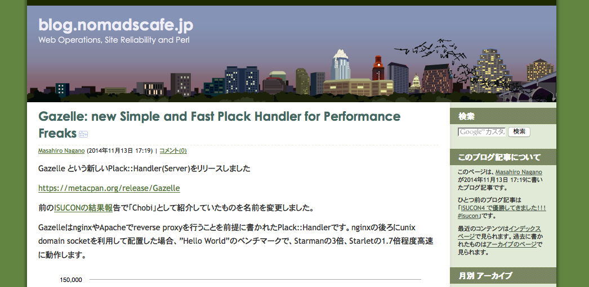

# 横浜に住んで。<br />横浜から離れて(仮)

Yusuke Wada a.k.a. yusukebe

2014/11/28

Yokohama.pm#12

---

## 横浜といえば...

---


---

## ジャンクフードと kazeburo さん

---

## Gazelle



---

## ガゼル！

---

ということで kazeburo さんが速いサーバを書いたので

**本番で**使ってみる！

---

試験環境じゃつまらないので稼働中の API サーバに入れてみる

```
$ cpanm Gazelle
```

```
$ lv /XXX/daemontools/bokete_api/run
```

```
carton exec start_server --path=/dev/shm/app.sock \
-- plackup -s Gazelle \
--max-workers 50 --max-reqs-per-child 10000 \
-E production-api -a ./psgi/bokete_web_api.psgi
```

---

とりあえず稼働中ですが...

参考にしにくいですが...

ab 打ってみた

```
$ ab -n 10000 -c 50 http://10.0.x.x/xxx/xxx
```

---

以下と結果を比較(他の環境は同じことを確認)

- A. Starlet <=> port <=> Nginx
- B. Gazelle <=> unix domain socket <=> Nginx

---

## 結果

1. ロジック無し
2. ロジック有り

---

## 1. ロジック無し

### Gazelle => 177% faster!!

---

## 2. ロジック有り

### Gazelle => 110% faster!!

---

## 速い！

って... もしてかして...

---

## unix domain socket だから？

---

## 以下で比較してみた

- B. Gazelle <=> unix domain socket <=> Nginx
- C. Starlet <=> unix domain socket <=> Nginx

---

## 結果

---

### 1. ロジック無し

- **Starlet** => 103% faster

<br />

### 2. ロジック有り

- **Gazelle** => 102% faster

---

> あれ？

---

## 悔しいのでユーザーからのアクセスが無い環境をつくって試した

---

### A. Starlet / port

1. => 504.57 req/sec
2. => 92.11 req/sec

<br />

### B. Gazelle / unix domain socket

1. => 625.65 req/sec
2. => 95.51 req/sec

<br />

### C. Starlet / unix domain socket

1. => 641.32 req/sec
2. => 92.30 req/sec

---

> なるほど！

---

## 結論

- Nginx へは port 接続より**unix domain socket を使うと速い!! ** (Starlet/Gazelle)
- ただ本アプリでは Starlet と Gazelle の差があまり見られなかった
- 「そもそも高速な App サーバ要らない」って誰かが言ってた！
- kazeburo さんありがとうございます(何かあればお伝えします)

---

## 宣伝

ハチイチ忘年会 12 月 13 日だよ！


